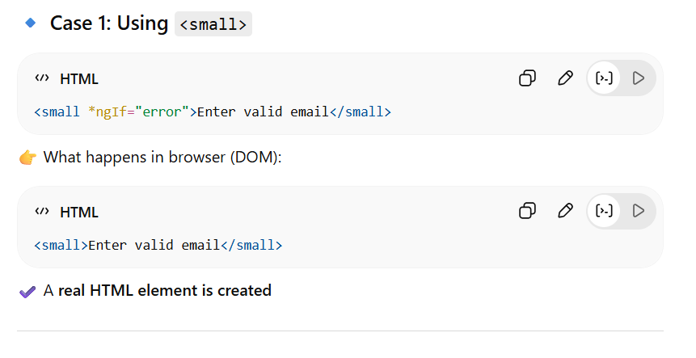
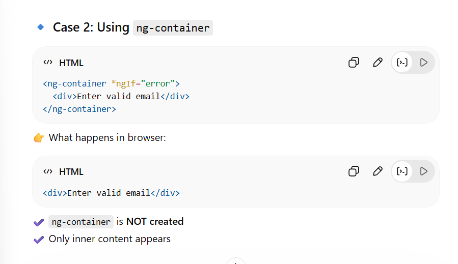

# SOLID PRINCIPLES:

- SOLID principles are five object-oriented design guidelines that make software systems more maintainable, flexible, and scalable.

- Coined by Robert C. Martin (Uncle Bob), they help developers reduce complexity, avoid tight coupling, and prevent code rot, ultimately leading to easier-to-test and cleaner codebases.

## S - Single Responsibility Principle (SRP):

- A class should have only one reason to change, meaning it should have only one job or responsibility.

SRP VIOLATION:

```JS
class UserService {
  saveUser(user) {
    // save to DB
  }

  sendEmail(user) {
    // send email
  }

  generateReport(user) {
    // generate report
  }
}
```

GOOD CODE EXAMPLE:

```JS
class UserRepository {
  save(user) {}
}

class EmailService {
  send(user) {}
}

class ReportService {
  generate(user) {}
}
```

## O - Open/Closed Principle (OCP):

- Your code should allow adding new features WITHOUT changing existing code

- Open → you can extend behavior
- Closed → you should NOT modify old working code

## L - Liskov Substitution Principle (LSP):

- A child class should be able to replace its parent class without breaking the program

## I - Interface Segregation Principle (ISP):

- Clients should not be forced to depend on methods they do not use; many specific interfaces are better than one general-purpose interface.

- Don’t force a class to implement methods it doesn’t need

- Instead of one big interface → use many small, specific interfaces
- Use only what you need

Bad Code Example (ISP Violation)

```JS
interface Machine {
  print();
  scan();
  fax();
}
// problem:
class BasicPrinter implements Machine {
  print() {
    console.log("Printing...");
  }

  scan() {
    throw new Error("Not supported"); // ❌
  }

  fax() {
    throw new Error("Not supported"); // ❌
  }
}

```

- Class is forced to implement unnecessary methods
  Leads to:

1. Errors
2. Confusion
3. Bad design

Good Code Example (ISP Applied)

```js
interface Printer {
  print();
}

interface Scanner {
  scan();
}

interface Fax {
  fax();
}

```

## D - Dependency Inversion Principle (DIP):

- High-level modules should NOT depend on low-level modules.
- Both should depend on abstractions (interfaces).

### Interface Segregation Principle and ingle Responsibility Principle (SRP) are used most.

# Different types of application:

### web application--> It runs in web browser, where we can access through url and we dont need to install it.

- example: facebook, w3schools, wikipedia, etc.

### desktop application-->It is installed directly on the computer.It can run without the browser.

- example:Microsoft Word, Excel, PowerPoint,photoshop

### mobile application-->It runs on smartphones.Installed from app stores.

- example: whatsapp, fb, etc

# 3 main things git is used for:

1. Branching-->Create separate versions of your code and Work on new features without affecting main code.
2. Merging--> Combine changes from different branches.
3. Tracking-->Git keeps history of every change
   we can see:
   who changed what
   when it was changed

# use of git stash:

- temporarily saves your uncommitted changes
  so you can switch branches or do something else without committing
- Pause my current work and hide it safely

### always ensure that we pull, before pushing the code, so that there are no merge conflicts.

# Html and css basics:

# difference b/w <p> and <div> tags:

The primary difference is semantic meaning: a tag defines a paragraph of text, while a tag is a generic container for grouping and styling other HTML elements. Both are block-level elements by default, but the tag has inherent meaning that the tag lacks.

<p> and <div> both are block elements.

### <p>

- <p> is used to define paragraphs of text

Automatically adds spacing (margin)
Meant only for text content
Semantic → browser understands it's a paragraph

### <div>

- <div>is a generic container

No meaning
Used for grouping elements

<span> is the inline element.

# Core css:

## Flexbox vs Grid:

- Flexbox is used for 1D layout (one direction)

Row → horizontal
Column → vertical

```js
.container {
  display: flex;
  flex-direction: row;    /* default */
flex-direction: column;
// for direction
justify-content: center;   /* horizontal */
align-items: center;
}
```

## Grid: it is used for 2D layouts:

```js
.container {
  display: grid;
  grid-template-columns: repeat(3, 1fr);
}
```

## position: relative, absolute, fixed:

Position
relative → slight move
absolute → inside parent
fixed → always on screen


# Spread operator(...):

- The spread operator (...) expands (unpacks) values from arrays or objects.
- Used to:

Copy data  
Merge data  
Update data immutably (very important in Angular) .


# closures:

- A closure is a function that remembers variables from its outer scope, even after that outer function has finished.

- Function remembers its data.

```js
function outer() {
  let count = 0;

  return function inner() {
    count++;
    console.log(count);
  };
}

const counter = outer();

counter(); // 1
counter(); // 2
```

# Asynchrnous programming:

- Async programming allows code to run without blocking UI.

- “Don’t wait → continue execution”

- It will not block the rendering of UI.

- Angular can render UI
  While API call is still running

# Promise:

- A Promise is an object that represents a future result of an asynchronous operation.
- I don’t have the data now… but I will get it later”
- A promise has 3 states:

1. fulfilled
2. rejected
3. Pending

```js
const promise = new Promise((resolve, reject) => {
  let success = true;

  if (success) {
    resolve("Data received");
  } else {
    reject("Error occurred");
  }
});
```

#### How to use promise

```js
promise
  .then((data) => console.log(data)) // success
  .catch((err) => console.log(err));
```

real example:

```js
fetch("https://api.com/users")
  .then((res) => res.json())
  .then((data) => console.log(data))
  .catch((err) => console.log(err));
```

```js
getData()
  .then((data) => processData(data))
  .then((result) => saveData(result))
  .then((final) => console.log(final))
  .catch((err) => console.log(err));
```

##### for parallel execution, we can use promise.all()

```js
Promise.all([fetch("api1"), fetch("api2")]).then((results) =>
  console.log(results),
);
```

- Promises are asynchronous

So:

- API call runs in background
- UI keeps rendering
- No blocking

# Components:

-A component = UI + logic

ng gc component-name

## types of component:

1. shared component: Reusable accross app.

Examples:

Navbar
Button
Card  
 2. standalone component:

- No module required
- Easier structure

```js
@Component({
 standalone: true,
 imports: [CommonModule]
})
```

# Modules

What is a Module?

- Groups related components

Feature-wise grouping:

UserModule
AdminModule

# Routing:

navigate between the pages without refreshing.

```js
const routes = [{ path: "home", component: HomeComponent }];
```

<a routerLink="/home">Go</a>

✔ No page reload
✔ SPA behavior

# Lazy loading(this is for performance)

- loads only when it is needed.

- In Angular, lazy loading is mainly used for modules (feature modules).

### with lazy loading:

App starts → Only Dashboard loaded
Click "Admin" → Admin module loads

```js
const routes: Routes = [
  {
    path: 'admin',
    loadChildren: () =>
      import('./admin/admin.module').then(m => m.AdminModule)
  }
];
```

# Data Binding:

- Data binding is the mechanism that connects your component (TypeScript) and template (HTML).
- It allows data to flow:

1. From component → UI
2. From UI → component
3. Or both ways

- Types of Data Binding in Angular

- Angular mainly supports 4 types, but they fall under:

1. One-Way Data Binding
2. Two-Way Data Binding

# 1. ONE-WAY DATA BINDING

👉 Data flows in **one direction only**

There are **3 types inside this:**

---

## 🔹 1. Interpolation ( {{ }} )

### 📌 Definition:

Used to display data from component → HTML

### ✅ Example:

```ts
// component.ts
name = "Aishwarya";
```

```html
<!-- template -->
<h1>Hello {{ name }}</h1>
```

👉 Output:

```
Hello Aishwarya
```

### 🧠 Key Point:

- Only **reads data**
- Cannot modify anything

---

## 🔹 2. Property Binding ( [ ] )

### 📌 Definition:

Bind component value to an HTML property

### ✅ Example:

```ts
isDisabled = true;
```

```html
<button [disabled]="isDisabled">Click Me</button>
```

👉 Button will be disabled

---

### 🔍 Why not use interpolation here?

```html
<!-- ❌ Wrong -->
<button disabled="{{isDisabled}}"></button>
```

Because:

- `disabled` is a **DOM property**, not just text

---

## 🔹 3. Event Binding ( ( ) )

### 📌 Definition:

Send data from HTML → component using events

### ✅ Example:

```ts
clickMe() {
  console.log("Button clicked");
}
```

```html
<button (click)="clickMe()">Click</button>
```

👉 When user clicks → function runs

---

## 🧠 One-Way Summary

| Type             | Direction        |
| ---------------- | ---------------- |
| Interpolation    | Component → View |
| Property Binding | Component → View |
| Event Binding    | View → Component |

---

# 🔵 2. TWO-WAY DATA BINDING

👉 Data flows **both ways simultaneously**

```
Component ⇄ View
```

---

## 🔹 Syntax: [( )] → called “banana in a box” 🍌📦

---

## 🔹 Example

```ts
name = "";
```

```html
<input [(ngModel)]="name" />
<p>{{ name }}</p>
```

---

## 🔄 What happens here?

1. User types → input updates `name`
2. `name` updates → UI updates automatically

👉 Both directions work

---

## 🔹 Important Requirement

You must import:

```ts
import { FormsModule } from "@angular/forms";
```

---

## 🔹 How it actually works internally

Two-way binding is just a combination of:

```html
<input [value]="name" (input)="name = $event.target.value" />
```

👉 So:

- `[value]` → property binding
- `(input)` → event binding

---

# 🔥 Real Example (Very Important)

### Scenario: Login Form

```ts
username = "";
```

```html
<input [(ngModel)]="username" /> <button (click)="login()">Login</button>
```

```ts
login() {
  console.log(this.username);
}
```

👉 No need to manually fetch input value — Angular handles it

---

# ⚖️ One-Way vs Two-Way (Important Difference)

| Feature     | One-Way       | Two-Way          |
| ----------- | ------------- | ---------------- |
| Direction   | One direction | Both directions  |
| Performance | Faster        | Slightly heavier |
| Control     | More control  | Less control     |
| Usage       | Display data  | Forms & inputs   |

---

# 🔗 How It Relates to What You Learned

From your previous questions:

### 🔹 Async / Promises

- Data from API → comes async → shown using **interpolation**

### 🔹 Angular

- Uses **change detection**
- Automatically updates UI when data changes

---

# 🧠 Final Understanding (Most Important)

👉 Angular’s power comes from **automatic UI updates**

Without data binding:

```js
document.getElementById("name").innerText = value;
```

With Angular:

```html
{{ name }}
```

👉 Much cleaner, scalable, and maintainable

---

# 🔚 Simple Summary

- **Interpolation** → show data
- **Property binding** → control DOM properties
- **Event binding** → handle user actions
- **Two-way binding** → sync UI + data

---

# Directives(“Change this element’s behavior or appearance”):

- Directives are classes that add new behavior or modify the existing appearance/behavior of elements in Angular applications. They are a fundamental concept used to manipulate the Document Object Model (DOM) and extend HTML's capabilities
  In Angular, there are three main types of directives:
  - Components: These are special directives that have their own templates and views. They are the main building blocks of an Angular application's UI, encapsulating logic and presentation. Every component is technically a directive, but not every directive is a component.


- Structural Directives (These change the structure of the DOM):

These directives change the DOM layout by adding, removing, or manipulating elements. They are easily identifiable in templates by the asterisk (*) prefix before their name, which is a shorthand syntax.
*ngIf: Conditionally adds or removes an element from the DOM.
*ngFor: Repeats a block of HTML for each item in a collection (list, array).
*ngSwitch: A set of cooperating directives that display one element from a potential group based on a switch condition.

- Attribute Directives(These change appearance or behavior, but NOT structure):

These directives modify the appearance or behavior of an existing element, component, or another directive, without changing the DOM structure itself. They are applied to elements as attributes.
[ngClass]: Conditionally adds or removes CSS classes.
[ngStyle]: Enables conditional application of inline CSS styles.
[ngModel]: Provides two-way data binding for form elements, syncing data between the UI and the application's data model.

- Developers can also create custom directives using the @Directive decorator to implement specific, reusable functionality. This approach promotes modular and maintainable code by separating cross-cutting concerns from core logic.

# event handling in angular:

- Event handling is used to capture user actions (click, input, submit, etc.) and execute logic in the component.

```js
event = "method()";
```

- Common Events
  (click) → button click
  (input) → typing
  (change) → value change
  (submit) → form submit
  (keyup) → keyboard events

# services:

- In Angular, services are TypeScript classes used to organize and share reusable code, data, and logic across different components. They are a core concept for promoting modularity, separation of concerns (keeping UI logic separate from business logic), and improving testability through Angular's dependency injection (DI) system.

- Service = reusable business logic or data provider.

- file uploading, type of files-->for services., we can write these type of code inside services, other than calling api urls.

- to share data btwn different components

## creating the service:

- ng generate service service-name

# Observables:

- Observables are used to handle asynchronous data streams.
- a stream of data that arrives over time

### example:

Real-Life Analogy

Think of a YouTube live stream 📺:

Data keeps coming continuously
You can start/stop watching anytime

👉 That’s how Observables work:

Emit values over time
You can subscribe/unsubscribe

Features:  
Multiple values
Lazy execution
Can cancel (unsubscribe)

```js
const obs = new Observable((observer) => {
  observer.next("Hi");
});

obs.subscribe((data) => console.log(data));

subscription.unsubscribe();
```

# Common Operators in observables:

map() → transform data
filter() → filter values
tap() → debug/log
switchMap() → API chaining

Observable = stream of data + async handling + powerful operators
Observable → subscribe → data → UI update

# Routing

Routing is used to navigate between different views (components) in a single-page application (SPA).

using router outlet, the component will be displayed.

```js
<router-outlet></router-outlet>
```

# ng-container:

<using small>
what happebs in browser-->
<small>Enter valid email</small>
extra html element is created.
but using ng-contianer-->extra elements is not created.
only inner elements are created.




### “ng-container is invisible. It is ONLY for Angular logic, not UI.”

- ng-container NEVER shows anything on screen
- It only helps Angular decide what to show
- ng-container NEVER shows anything on screen. It only helps Angular decide what to show

# Difference between (ngsubmit) and (click):

The core difference is that is a generic HTML event for user clicks on any element, while is an Angular-specific directive that handles the event of a element, which incorporates important form-handling functionalities like validation and accessibility features. [1, 2]  
Key Differences

| Feature [1, 2, 3, 4, 5, 6, 7, 8, 9] | (or in Angular)                                                                                                                                        |                                                                                                                                                            |
| ----------------------------------- | ------------------------------------------------------------------------------------------------------------------------------------------------------ | ---------------------------------------------------------------------------------------------------------------------------------------------------------- |
| Event Type                          | Handles a generic event.                                                                                                                               | Binds to the HTML event on a form.                                                                                                                         |
| Applicability                       | Can be used on any HTML element (buttons, divs, links, etc.).                                                                                          | Used specifically on a element.                                                                                                                            |
| Trigger Methods                     | Only triggers when the element is clicked with a mouse or an equivalent action.                                                                        | Triggers on button click (if ) or when the user presses the key within any form input field.                                                               |
| Angular Integration                 | A basic event binding; it does not inherently interact with Angular's form validation logic.                                                           | Fully integrates with Angular's form directives (, ), respecting built-in validations (e.g., , ) before the associated function is called.                 |
| Default Behavior                    | Does not prevent the browser's default action (e.g., a button with might still submit the form in the traditional HTML way if not prevented manually). | In Angular, automatically prevents the default browser form submission (which reloads the page), allowing for single-page application (SPA) functionality. |

When to Use Which:

• Use <b>(ngSubmit)</b> for all form submissions in Angular applications. This is considered the best practice because it provides a better user experience (keyboard accessibility) and leverages Angular's powerful built-in form validation features.  
• Use <b>(click)</b> (the Angular equivalent of ) for non-form interactions, such as opening a modal, navigating to a different view, or any general button outside of a form whose action is not intended to submit data.

best advantage-->
Angular automatically prevents full page reload

# view child and native element:

1. In Angular, you use @ViewChild and nativeElement to handle scrolling because scrolling is a DOM-level action. While Angular is great at managing data, things like scroll positions, focus, and element measurements belong to the browser's physical layout, which Angular doesn't control directly through typical data binding. [1, 2, 3]
   Here is the detailed breakdown of why this approach is used for your chatbot:
1. Direct Access to DOM Properties [4]
   Angular’s data-binding (like [property]="value") is meant for changing attributes or content. However, to scroll, you need to access specific browser properties that aren't available through standard bindings: [3]

- scrollHeight: The total height of all messages (including those hidden off-screen).
- scrollTop: The current position of the scroll bar.
  By using nativeElement, you get a "handle" on the actual HTML <div> so you can manually set scrollTop = scrollHeight whenever a new message arrives. [5, 6]

2. Imperative Control vs. Declarative Binding
   Angular is "declarative"—you tell it what to show. Scrolling is "imperative"—you tell the browser how to move. [3]

- In a chatbot, when a new message is added to your array, Angular updates the list. But it doesn't automatically know that you want the view to jump to the bottom.
- @ViewChild provides the "bridge" between your TypeScript logic and the rendered HTML so you can trigger that jump exactly when a new message is received. [3, 7]

3. Timing with Lifecycle Hooks
   The biggest challenge in chatbots is that you cannot scroll to a message until it actually exists in the DOM.

- If you try to scroll the moment you push a message to your array, the browser might not have finished rendering the new message bubble yet.
- By using @ViewChild inside the ngAfterViewChecked or ngAfterViewInit lifecycle hooks, you ensure that the message is fully rendered and the scrollHeight is updated before you tell the browser to move the scroll bar. [5, 8, 9, 10]

Exact Use Cases in Your Chatbot:

- Auto-Scroll on Message: Automatically jumping to the bottom when the bot or user sends a message.
- Smart Scroll: Only scrolling to the bottom if the user is already near the bottom (preventing the view from jumping while the user is reading older messages).
- Initial Load: Ensuring the chat window starts at the very bottom when the user first opens the chat. [2, 9, 10, 11, 12]

Recommendation: For a modern Angular chatbot, you can use the new viewChild() signal function for a cleaner, more reactive way to get this reference. [3, 13]

angular is declarative-->we tell what to show, but scrolling is broswer level action, how browser movie (imperative), it does not have access directly, so we use native element...via view child.

# custom validators:

```js
validators: (group: AbstractControl) => {
  const password = group.get('password')?.value;
  const confirmPassword = group.get('confirmPassword')?.value;

  // Logic: If they match, return null (All good!)
  // If they don't match, return the error key.
  return password === confirmPassword ? null : { passwordMismatch: true };
}
```

    //This is the base class for FormControl, FormGroup, and FormArray.
      // By typing the parameter as AbstractControl,you can access the entire group.

      //The Group Level: Because you need to compare two different fields, this validator is attached to the FormGroup, not the individual confirmPassword field.

# APi Integration via backend:

```js
User → Login Form → Component → API Service → Backend
                                     ↓
                              Response (token)
                                    ↓
                           Local Storage (token)
                                    ↓
                 Interceptor adds token to every request
                                    ↓
                             Guard protects routes
                                    ↓
                              Header shows Logout


```

1. environment.ts / environment.prod.ts :
   keep the base url

2. api.service.ts:  
   place all the api calls
   It is reusable.

```js
get<T>()
post<T>()
login()
query()
```

3. model.ts:  
   Define request & response structure
4. local.service.ts  
   Handle localStorages
5. auth.service.ts  
   Handle authentication logic

```js
isAuthenticated();
logout();
```

6. auth-interceptor.service.ts  
   Attach token to every API request

```js
Authorization: Bearer token
```

7. Authorization: Bearer token
   protect routes.

```js
if (token) → allow
else → redirect login
```

```js
Login Form → onSubmit() → ApiService → Backend
                         ↓
                    Response (token)
                         ↓
                 LocalService (store)
                         ↓
Router → /chatbot
                         ↓
AuthGuard (checks token)
                         ↓
Interceptor (adds token to APIs)
                         ↓
Header/AuthService (shows logout)
```

1. # model.ts (The Contract)
   This file defines the Interfaces. In a 15-year dev's world, this is the "Source of Truth."

What's happening: It ensures that every part of your app knows exactly what a Login request looks like (email/password) and what the server will send back (access_token).

Role: It provides Type Safety. If you accidentally type pass_word instead of password in your service, TypeScript will catch it before you even run the code.

2. # local.service.ts (The Vault)
   This is a wrapper around the browser's localStorage.

What's happening: It provides helper methods to set, get, and remove data.

The "Pro" Touch: Notice the JSON.stringify and JSON.parse. LocalStorage can only store strings. This service makes it so you can pass objects or arrays into it without manually converting them every time.

Role: It is the Persistence Layer. It makes sure your token stays in the browser even if the user refreshes the page.

3. # api.service.ts (The Messenger)
   This is your gateway to the backend.

What's happening: Instead of calling http.post everywhere in your app, you’ve centralized it. The login() method specifically uses the LoginRequest and LoginResponse interfaces from your model.

The "Pro" Touch: You used Generics (<T>). This means this service is reusable for any data type, making it very dry (Don't Repeat Yourself).

Role: It is the Data Access Layer.

4. # auth.interceptor.ts (The Invisible Guard)
   This is a "Middle-man" for every single HTTP request your app makes.

What's happening: 1. It "intercepts" a request before it leaves the browser. 2. It checks: "Is this a login request?" If yes, it lets it through (because you don't have a token yet). 3. If it's any other request (like fetching chat history), it grabs the token from the Local service. 4. It clones the request and attaches the Authorization: Bearer <token> header.

Role: It handles Global Security so you don't have to manually add headers to every single API call.

5.  # auth.service.ts (The Logic/State)
    This service answers the question: "Is the user currently logged in?"

What's happening: \* isAuthenticated(): It checks the Local service for a token. The !! (double bang) converts a "truthy" value (the token string) into a boolean true.

logout(): It wipes the storage clean.

Role: It is the Identity Provider for your application's guards and UI components.

6. # onSubmit() in Component (The Conductor)
   This is where the orchestra starts playing. Let’s trace the flow:

Validation: It checks loginForm.invalid. If you missed a field, it stops right there.

Payload: It gathers the form data and shapes it into a LoginRequest.

The Call: It calls api.login(payload).

The Subscription: \* The Service sends the HTTP request.

The Interceptor sees it’s a "login" URL and lets it pass without a header.

The Server returns a token.

next(res) triggers: The token is saved into Local service.

Navigation: Once the token is safe, it tells the Router to take the user to the /chatbot page.

# Total flow:

How they connect (The Flow):User clicks Submit --> Component (onSubmit).  
Component calls API Service (login).  
API Service calls Interceptor.  
Interceptor lets request go to Backend.Backend returns Token --> Component receives it.  
Component saves Token to Local Service.  
Auth Service now sees isAuthenticated() as true.  
Component navigates to Chat.
